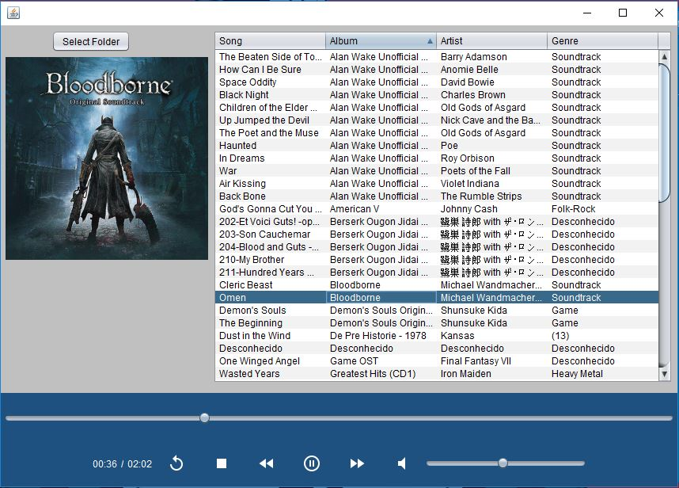

# Music Player
A music player made with Java/JavaFX/Swing.
 

## Description

There are three main classes:

### AppPlayer
This class handles the logic of the music playback and updates the time slider and time label
accordingly.

### FileExtensionFilter
This class filters the files listed in the AppPlayer logic when searching for files to build the library.

### PlayerWindow
This class describes the layout of the JFrame and its components as well as some logic to handle actions.
